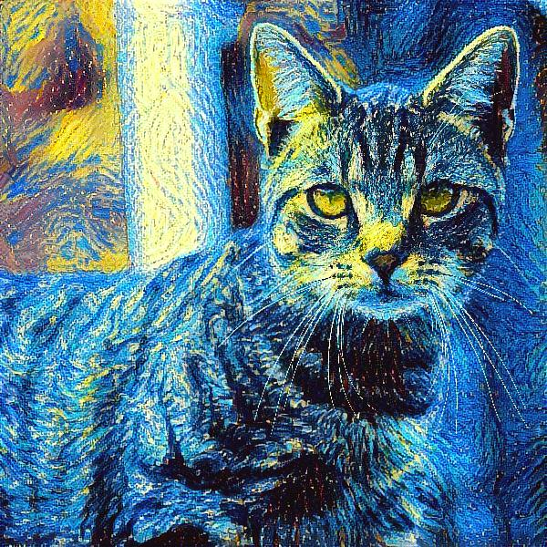
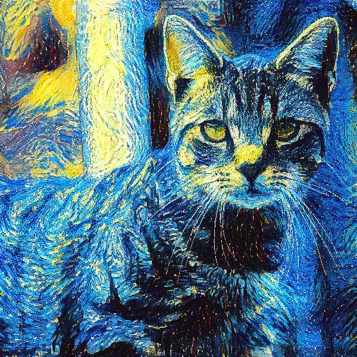
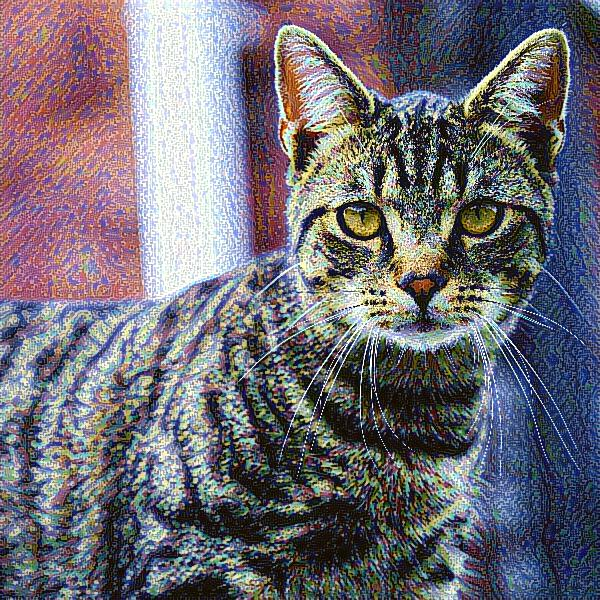
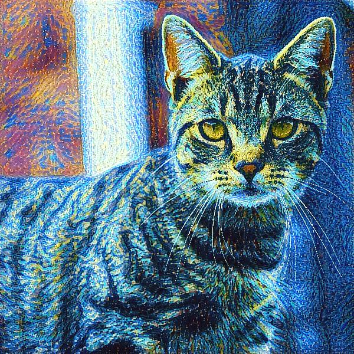
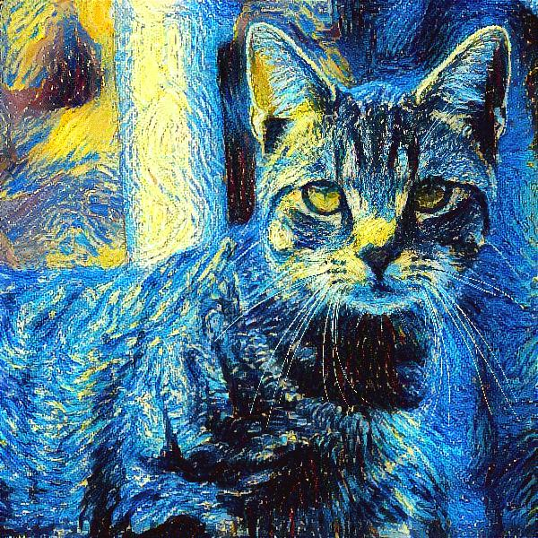

# Neural Style Transfer (NST) using Convolutional Neural Networks (CNN)

## Overview

Neural Style Transfer (NST) is a deep learning technique that applies the artistic style of one image to another while preserving the content of the second image. This is achieved using Convolutional Neural Networks (CNNs) to extract and manipulate image features at different layers.

## Methodology

NST utilizes a pre-trained CNN (VGG19) to extract content and style features from images. The objective function combines multiple loss components:

- **Content Loss**: Ensures that the generated image maintains the structure of the content image.
  
  $` L_{content} = \frac{1}{2} \sum (C_{content} - G_{generated})^2 `$
  
  where:
  - $`( C_{content} )`$ represents the feature map of the content image.
  - $`( G_{generated} )`$ represents the feature map of the generated image.

- **Style Loss**: Captures the texture and color patterns of the style image using Gram matrices.
  
  $` L_{style} = \sum (Gram(S_{style}) - Gram(G_{generated}))^2 `$
  
  where:
  - $`( S_{style} )`$ represents the feature map of the style image.
  - $`( G_{generated} )`$ represents the feature map of the generated image.
  - $`( Gram(X) )`$ represents the Gram matrix of the feature map \( X \).

- **Total Variation Loss**: Reduces noise and enhances smoothness in the generated image.
  
  $` L_{TV} = \sum_{i,j} ((I_{i,j+1} - I_{i,j})^2 + (I_{i+1,j} - I_{i,j})^2) `$
  
  where $`( I )`$ represents pixel intensities of the generated image.

- **Total Loss**: Combines all three loss components to guide the optimization process.

  $`L_{total} = \alpha L_{content} + \beta L_{style} + \gamma L_{TV}`$

  where:

  - $`(\alpha)`$ controls the weight of the content loss.
  - $`(\beta)`$ controls the weight of the style loss.
  - $`(\gamma)`$ controls the weight of the total variation loss.

## Implementation Steps

### 1. Load Pre-trained Model

VGG19 is used as the base network for feature extraction.

### 2. Feature Extraction

- Content features are taken from deeper layers (`block5_conv2`).
- Style features are extracted from multiple layers (`block1_conv1`, `block2_conv1` ,`block3_conv1` ,`block4_conv1` ,`block5_conv1` ).

### 3. Define the Loss Function

- **Content loss**: Mean Squared Error (MSE) between content and generated images.
- **Style loss**: Computed using Gram matrices.
- **Total variation loss**: Applied to enhance smoothness.

### 4. Optimization

- The generated image is initialized with the content image.
- The Adam optimizer is used to minimize the total loss.

### 5. Iterative Update

- The generated image is updated iteratively to refine the style transfer.


## Dependencies

Ensure you have the following dependencies installed:

```bash
pip install tensorflow numpy
```


## Usage

1. Prepare a content.jpg and a style.jpg.
2. Update target size based on your hardware capability.
3. Adjust hyperparameters (content weight/style weight/iterations) for desired results. 
4. Run the NST script.
5. Display the image 'output.jpg' upon the execution of the code.

## Results & Observations
| Content Image                            | Style Image                            |
|-----------------------------------|-----------------------------------|
|  |  |

### Result Image 
| Iteration 17000                            | Iteration 30000                            |
|-----------------------------------|-----------------------------------|
|  |  |


### Neural Style Transfer Iteration Progress

| Iteration 3000                     | Iteration 9000                     | Iteration 17000                    | Iteration 23000                    | Iteration 30000                    |
|-----------------------------------|-----------------------------------|-----------------------------------|-----------------------------------|-----------------------------------|
|  |  |  |  |  |

- A higher style weight produces more pronounced artistic patterns.
- While additional iterations generally improve blending, they may also introduce artifacts.
- After a process of trial and error, 17,000 iterations have proven optimal for preserving realism and content details, while 30,000 iterations result in a more artistic, abstract effect, with a content weight of 1 and a style weight of 10,000.
- The choice of VGG19 layers significantly affects the quality of the transferred features.

## References

- Gatys et al., "A Neural Algorithm of Artistic Style"
- TensorFlow and Keras documentation

